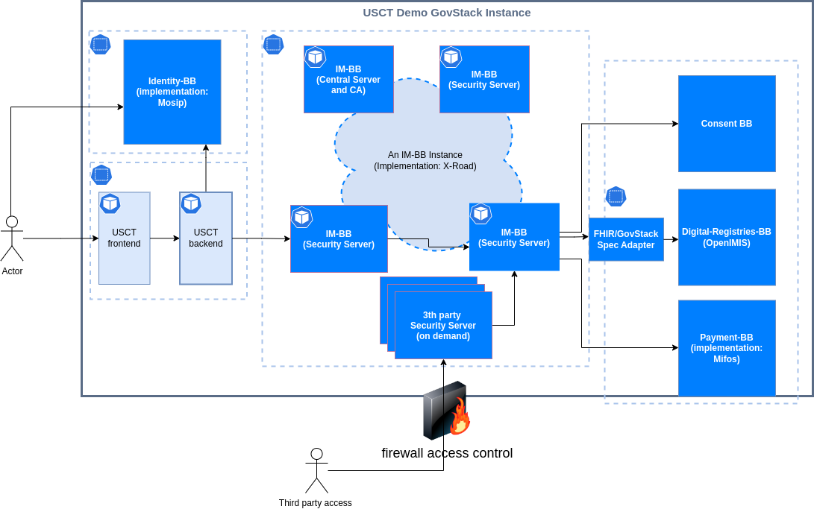

# Third party access to the building blocks

On demand, sandbox team can up and run security server to access the sandbox.

The security server API will be firewall protected (IP whitelisting) and the UI will be credential protected.

The security server will be pre-configured, but client can change configuration and play with it. 

Dedicated security server that is connected to X-road and has the right to communicate with other building blocks.

## Provision guide line
1. Receive IP address from the client.
2. Deploy new security server to the playground cluster.
3. Configure new security server and others for communication.
4. Configure firewall rules 
5. Generate user interface credentials.